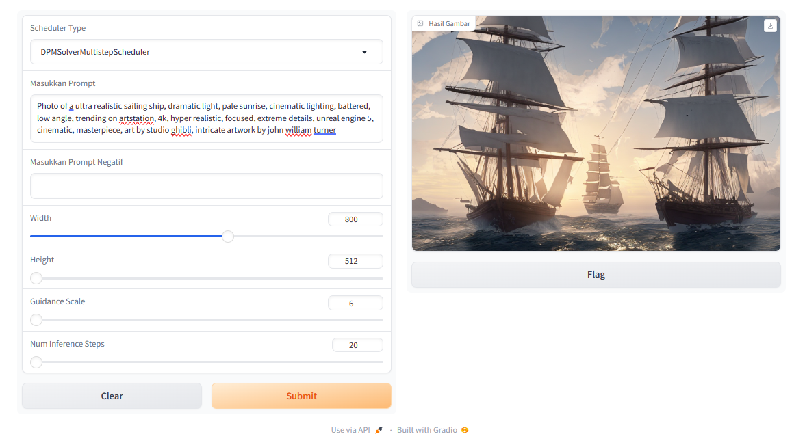

# openjourney-inference
<a target="_blank" href="https://colab.research.google.com/github/Damarcreative/openjourney-inference/blob/main/inference.ipynb">
  
</a>

## Description
This is a Python script to generate images using the diffusers library with OpenJourney models with various types of schedulers. This script uses Gradio to create a simple user interface for setting parameters and viewing the resulting images.

<table class="custom-table">
  <tr>
    <td>
      <a href="https://huggingface.co/Linaqruf/animagine-xl/blob/main/sample_images/image (1).png">
        
      </a>
      <a href="https://huggingface.co/Linaqruf/animagine-xl/blob/main/sample_images/image (3).png">
        
      </a>
    </td>
    <td>
      <a href="https://huggingface.co/Linaqruf/animagine-xl/blob/main/sample_images/image (2).png">
        
      </a>
      <a href="https://huggingface.co/Linaqruf/animagine-xl/blob/main/sample_images/image (4).png">
        
      </a>
    </td>
  </tr>
</table>

## Usage Steps
1. Install dependencies by running the following command:
```
pip install -q diffusers transformers omegaconf accelerate gradio
```
2. Run the script and enter the prompt and other parameters via the user interface that appears.

3. Select the scheduler type from the dropdown provided.

4. Determine the location to save the resulting image by setting folder_path in the markdown section.

5. Press the generate button to generate an image.

### Parameter
`scheduler_type`: Scheduler type for the diffusion model.

`prompt`: Prompt to generate image.

`negative_prompt`: Negative prompt to form an image concept.

`width`: The width of the resulting image.

`height`: The height of the resulting image.

`guidance_scale`: Guidance scale to control the degree to which guidance influences results.

`num_inference_steps`: Number of inference steps used.

### Usage Example
#### Import Libraries
```
import gradio as gr
from diffusers import (
    StableDiffusionPipeline,
    DDPMScheduler,
    DDIMScheduler,
    PNDMScheduler,
    LMSDiscreteScheduler,
    EulerDiscreteScheduler,
    EulerAncestralDiscreteScheduler,
    DPMSolverMultistepScheduler
)
import torch
import os
import re
from PIL import Image
```

#### Load Model
```
repo_id = "prompthero/openjourney-v4"
pipe = StableDiffusionPipeline.from_pretrained(repo_id, torch_dtype=torch.float16)
pipe.to("cuda")
```
#### Run with UI
```
scheduler_types = ["LMSDiscreteScheduler", "DDIMScheduler", "DPMSolverMultistepScheduler",
                   "EulerDiscreteScheduler", "PNDMScheduler", "DDPMScheduler",
                   "EulerAncestralDiscreteScheduler"]

# Add a dropdown for selecting the scheduler type
scheduler_type_dropdown = gr.Dropdown(choices=scheduler_types, label="Scheduler Type")

# @markdown lokasi untuk menyimpan hasil gambar:
folder_path = "/content/"
output_folder = folder_path + "/"

def find_last_image_number():
    # Find the last image number in the folder
    image_files = [f for f in os.listdir(output_folder) if f.startswith("images_") and f.endswith(".png")]
    if not image_files:
        return 0  # No existing images
    last_number = max(int(re.search(r'\d+', f).group()) for f in image_files)
    return last_number

# Variable to keep track of the count
existing_image_count = find_last_image_number()

def generate_image(scheduler_type, prompt, negative_prompt, width, height, guidance_scale, num_inference_steps):
    global existing_image_count
    existing_image_count += 1

    output_path = os.path.join(output_folder, f"images_{existing_image_count}.png")
   # Assuming 'pipe' is defined or imported
    if scheduler_type == "LMSDiscreteScheduler":
        pipe.scheduler = LMSDiscreteScheduler.from_config(pipe.scheduler.config)
    elif scheduler_type == "DDIMScheduler":
        pipe.scheduler = DDIMScheduler.from_config(pipe.scheduler.config)
    elif scheduler_type == "DPMSolverMultistepScheduler":
        pipe.scheduler = DPMSolverMultistepScheduler.from_config(pipe.scheduler.config)
    elif scheduler_type == "EulerDiscreteScheduler":
        pipe.scheduler = EulerDiscreteScheduler.from_config(pipe.scheduler.config)
    elif scheduler_type == "PNDMScheduler":
        pipe.scheduler = PNDMScheduler.from_config(pipe.scheduler.config)
    elif scheduler_type == "DDPMScheduler":
        pipe.scheduler = DDPMScheduler.from_config(pipe.scheduler.config)
    elif scheduler_type == "EulerAncestralDiscreteScheduler":
        # pipe.scheduler = EulerAncestralDiscreteScheduler.from_config(pipe.scheduler.config)
        pipe.scheduler = EulerAncestralDiscreteScheduler(num_train_timesteps=1000, beta_start=0.00085, beta_end=0.012, beta_schedule="scaled_linear")

    image = pipe(
        prompt=prompt,
        negative_prompt=negative_prompt,
        width=width,
        height=height,
        guidance_scale=guidance_scale,
        num_inference_steps=num_inference_steps,
    ).images[0]

    image.save(output_path)
    return output_path

input_prompt = gr.Textbox(label="Masukkan Prompt")
input_negative_prompt = gr.Textbox(label="Masukkan Prompt Negatif")
slider_width = gr.Slider(minimum=512, maximum=1024, label="Width")
slider_height = gr.Slider(minimum=512, maximum=1024, label="Height")
slider_guidance_scale = gr.Slider(minimum=6, maximum=24, label="Guidance Scale")
slider_num_inference_steps = gr.Slider(minimum=20, maximum=200, label="Num Inference Steps")
output_image = gr.Image(label="Hasil Gambar")

def handle_generate_button(scheduler_type, prompt, negative_prompt, width, height, guidance_scale, num_inference_steps):
    output_path = generate_image(scheduler_type, prompt, negative_prompt, width, height, guidance_scale, num_inference_steps)
    return output_path

iface = gr.Interface(
    fn=handle_generate_button,
    inputs=[scheduler_type_dropdown, input_prompt, input_negative_prompt, slider_width, slider_height, slider_guidance_scale, slider_num_inference_steps],
    outputs=output_image,
    title="Openjourney",
    description = "tes"
)

iface.launch()
```




